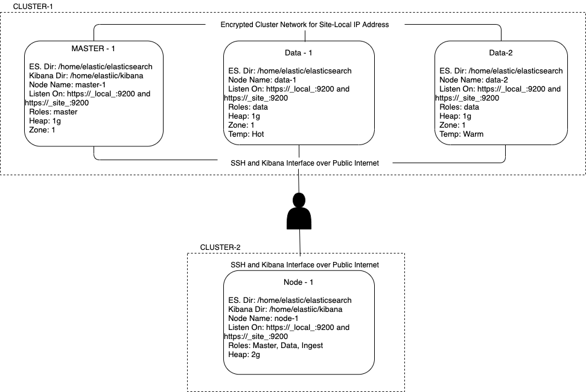

# Deploying an ES Cluster

Topics covered here

- Prepare a Linux system for Elasticsearch
- Deploy Elasticsearch from and archive
- Configure a multi-node cluster
    * Add custom node attributes
    * Bind Elasticsearch to specific addresses
    * Configure node roles
    * Name a cluster
    * Name each node in a cluster
    * Configure node discovery
- Configure a single-node cluster
- Start Elasticsearch
- Deploy Kibana
- Configure Kibana
- Start Kibana


## Prepare a Linux system for Elasticsearch

We will be deploying two ES cluster with the following specification

**Cluster-1:** total 3 nodes
- 1 Master + Kibana Node
- 2 Data Nodes

**Cluster-2:** total 1 nodes
- 1 Master + Kibana Node

Why two clusters, this is to demonstrate

1. Cross Cluster search functionality
2. Cross Cluster Replication
3. Backups and Restore Operations


## Architecture

The below will be the architecture of the cluster we will be creating.



### Implementation

For implementing the above architecture we will follow the following approaches:

1. Cloud Based VMs
    Spin up 4 small nodes with 2g memory, do check u can ssh into each of the nodes. The

2. Vagrant Based VMs
    Will be covered in the next sections.

##  Deploy Elasticsearch from and archive

1. create a user "elastic"
2. Disabling the swap space
3. file descriptors or file handles increased, "elastic - nofile 65536" >> add this to /etc/security/limits.conf
4. Virtual memory increased, "vm.max_map_count = 262144" >> /etc/sysctl.conf
5. Increase number of threads, "elastic - nproc 4096" >> add this to /etc/security/limits.conf
6. Address space to unlimited [Part of Bootstrap check]

Run the file with sudo privileges

```sh
#!/bin/bash

useradd elastic
swapoff -a

# sed to comment the swap partition in /etc/fstab and keep a backup

sed -i.bak -r 's/(.+ swap .+)/#\1/' /etc/fstab
echo "elastic - nofile 65536" >> /etc/security/limits.conf
echo "vm.max_map_count = 262144" >> /etc/sysctl.conf
echo "elastic - nproc 4096" >> /etc/security/limits.conf

# Refresh the sysctl
sysctl -p

# run the command as elastic user
sudo -u elastic -H sh -c "
cd /home/elastic; 
curl -O https://artifacts.elastic.co/downloads/elasticsearch/elasticsearch-7.2.1-linux-x86_64.tar.gz;
tar -xzf elasticsearch-7.2.1-linux-x86_64.tar.gz
mv elasticsearch-7.2.1 elasticsearch
rm -rf elasticsearch-7.2.1-linux-x86_64.tar.gz
"
```

After having the installation, time to configure elasticsearch
on each node, as per the architecture diagram.


## Configure a multi-node cluster

Elasticsearch Config yaml to be copied as per the node.
**For cluster-1**
```yml
# master node
cluster.name: cluster-1
node.name: master-1
node.attr.zone: 1
network.host: [_local_, _site_]
cluster.initial_master_nodes: ["master-1"]
node:
  master: true
  data: false
  ingest: false

# data node - 1
cluster.name: cluster-1
node.name: data-1
node.attr.zone: 1
node.attr.temp: hot
network.host: [_local_, _site_]
discovery.seed_hosts: ["172.31.30.103"] # tell the discovery hosts, private ip of master nodes
cluster.initial_master_nodes: ["master-1"]
node:
  master: false
  data: true
  ingest: false

# data node-2
cluster.name: cluster-1
node.name: data-2
node.attr.zone: 1
node.attr.temp: hot
network.host: [_local_, _site_]
discovery.seed_hosts: ["172.31.30.103"]  # tell the discovery hosts, private ip of master nodes
cluster.initial_master_nodes: ["master-1"]
node:
  master: false
  data: true
  ingest: false
```

## Configure a single-node cluster
**For cluster-2**
```yml
# single node cluster
cluster.name: cluster-2
node.name: node-1
node.attr.zone: 1
network.host: [_local_, _site_]
cluster.initial_master_nodes: ["node-1"]
node:
  master: true
  data: true
  ingest: true
```

!!! note
    Update jvm.options file with the correct memory
    settings, 1g is the default. 


### Start the elasticsearch 

Run from the elasticsearch folder

```./bin/elasticsearch -d -p pid```

this will give u the process pid which u can use to kill the process.

check the nodes are connected by checking logs or running the command 
```curl http://localhost:9200/_cat/nodes?v```

## Install kibana

Run the following command on master-1 node

```sh
curl -O https://artifacts.elastic.co/downloads/kibana/kibana-7.2.1-linux-x86_64.tar.gz;
tar -xzf kibana-7.2.1-linux-x86_64.tar.gz
```

## Start kibana
From directory in which you installed kibana
```./bin/kibana```


