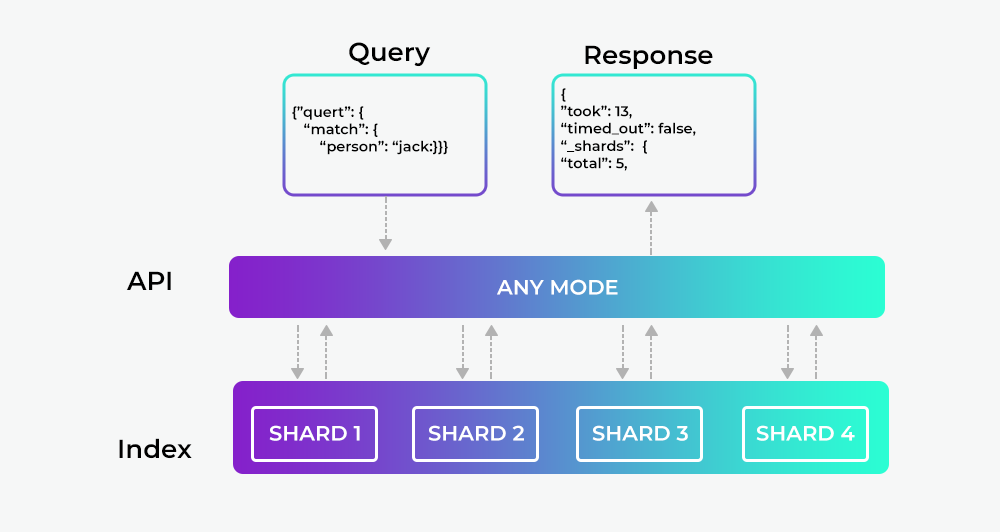

# **What is Elasticsearch ?**
---

In simplest terms we need a search engine or technology to easily retrieve the relevant result in the shortest amount of time.
Few personal areas I think any search engine should answer

1. How can I search the documents ?
2. How can I analyse them and take out useful data out of it ?
3. How it can be scalable ?
4. Ease of use and community support.

There are many tools right now that can help you with the above points, one of the tools which the community and enterprise are using is Elasticsearch.

Elasticsearch is an open-source search engine built on top of Apache Lucene, which is a full-text search-engine library.
Thing to notice Lucene is just a library, to leverage its power, we need to work in Java integrate it directly with the application.
Lucene is very complex and this approach is time and resource consuming.

**Elasticsearch to the rescue**

Elasticsearch, written in Java which uses Lucene internally for all of its indexing and searching,
it aims to make full-text search easy by hiding the complexities of Lucene behind a simple, coherent, RESTful API. 

However Elasticsearch is more then "just" full-text search.

It can also be described as follows:
- A distributed near real-time document store where every field is indexed and searchable.
- A distributed search engine with real-time analytics
- Capable of scaling to hundreds of servers and petabytes of structured and unstructured data

Moreover it packages up all this functionality into a standalone server that any application can talk to via a simple **RESTful API**,
using any webclient or just cli or even simple curl commands



## REST-API with JSON over HTTP

Having an API endpoint exposed (default 9200) any client can communicate with Elasticsearch.

A request to Elasticsearch consists of the same parts as any HTTP request:

```shell
curl -X<VERB> '<PROTOCOL>://<HOST>/<PATH>?<QUERY_STRING>' -d '<BODY>'
```

where

- `VERB`: The appropriate HTTP method or verb: GET, POST, PUT, HEAD, or DELETE.

- `PROTOCOL`: Either http or https 

- `HOST`: The hostname of any node in your Elasticsearch cluster, or localhost for a node on your local machine.

- `PORT`: The port running the Elasticsearch HTTP service, which defaults to 9200.

- `QUERY_STRING`:  Any optional query-string parameters 

- `BODY`: A JSON-encoded request body

Example - to count the number of documents in the cluster

```bash
curl -XGET 'http://localhost:9200/_count?pretty' -d '
{
    "query": {
        "match_all": {}
    }
}'
```

## **Document Oriented**

Elasticsearch is document oriented, meaning that it **stores entire objects as documents**.

In simpler terms 

- any message, event you send to Elasticsearch is saved as a Document in JSON format.
- Also ES not only stores them, but also indexes the contents of each document in order to make them searchable.

In short you index, search, sort, and filter documents — not rows of columnar data.

!!! note
    Elasticsearch uses JavaScript Object Notation, or **JSON**, as the serialization format for documents.

    JSON serialization is supported by most programming languages, and has become the standard format used by the NoSQL movement.


## **Closing points**

The above points can help you understanding the rational behind Elasticsearch, but with any technology it doesn't give justice without
an example. Check the next section [Finding Your Feet](Finding-your-feet.md) for a easy to start example.

